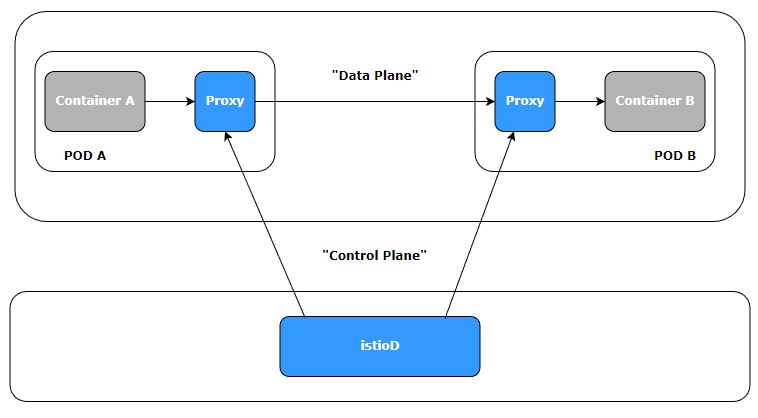
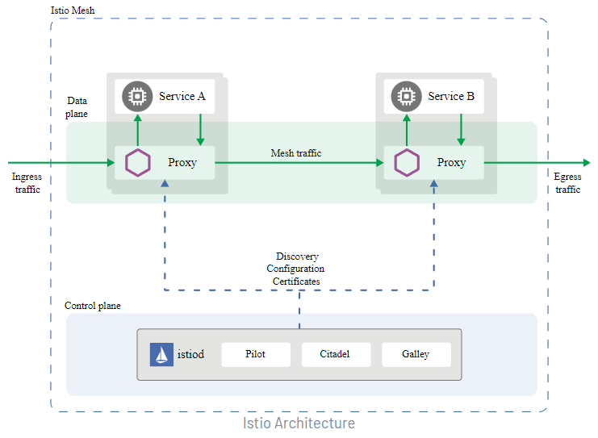
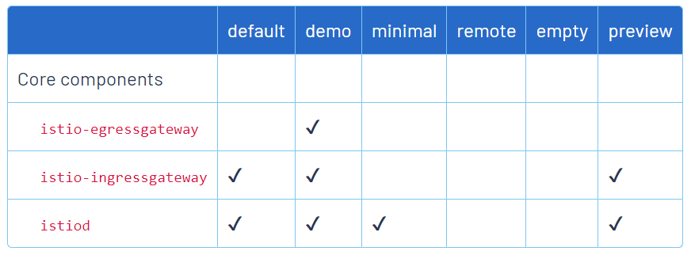
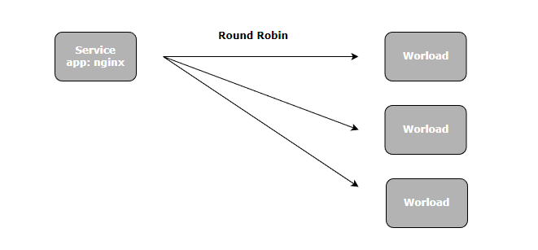
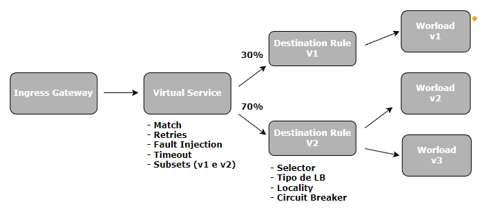

# Service Mesh Istio

## Introdução

- Aula 1: Introdução ao Service Mesh Istio

- Aula 2: O Mundo distribuído
    

- Aula 3: Service Mesh vs Istio
    - O que é Service Mesh?
    Service Mesh ou malha de serviço é uma camada extra adicionada junto ao seu cluster visando monitorar e modificar em tempo real o tráfego das aplicações, bem como elevar o nível de segurança e confiabilidade de todo o ecossistema.
    - O que é Istio?
    Istio é um projeto open-source que implementa service mesh visando diminuir a complexidade no gerenciamento de aplicações distribuídas independente de qual linguagem ou tecnologia(s) que foram desenvolvidas.
    - Istio funciona em diversas plataformas, tais como, Kubernetes, Apache Mesos, Consul e NOMAD.

- Aula 4: Principais recursos
    - Por que preciso de uma Service Mesh? Istio?
        - Gerenciamento de tráfego
            - Gateways (Entrada e saída)
            - Load Balacing
            - Timeout
            - Políticas de retry
            - Circuit Breaker
            - Fault Injection
        - Observabilidade
            - Métricas
            - Traces distribuídos
            - Logs
        - Segurança
            - Man-in-the-middle
            - mTLS
            - AAA (authentication, authorization e audit)

- Aula 5: Arquitetura do Istion
    - Dinâmica && Sidecar Prpxy
    
    - Arquitetura do Istio
    

- Aula 6: Monitoramento em tempo real
    - Mostrado a ferramenta que será utilzada para monitoramento (Kiali)

## Código Fonte

- Aula 7: Código fonte
    - Disponibilizado repositório git para acompanhamento das aulas <https://github.com/devfullcycle/fc-istio>

## Instalação

- Aula 8: Instalação
    - Falando sobre o processo de instalação do Istio e o que será utilizado no decorrer das aulas.

- Aula 9: Instalando k3d
    - Link do k3d <https://k3d.io/v5.4.9/>
    - k3d instalado via chocolatey
        ```
        choco install k3d
        ```

- Aula 10: Criando cluster
    - Criando um cluster pelo k3d
        ```
        k3d.exe cluster create -p "8000:30000@loadbalancer" --agents 2
        ```

- Aula 11: Instalando istio ctl
    - Link do Istio <https://istio.io/>
    - Instalando o istioctl via chocolatey
        ```
        choco install istioctl
        ```

- Aula 12: Instalando istio no cluster
    - Link para instalação do istio <https://istio.io/latest/docs/setup/getting-started/>
    - O istio trabalha com profiles no qual escolhemos os módulos que serão instalados <https://istio.io/latest/docs/setup/additional-setup/config-profiles/>
    - Instalando o istio default
    
        
    
        ```
        istioctl.exe install
        ```
    - Verificando a instalação do istio
        ```
        kubectl get ns
        ```
        ```
        kubectl get po -n istio-system
        ```
        ```
        kubectl get svc -n istio-system
        ```

- Aula 13: Injetando sidecar proxy
    - criando e aplicando o primeiro deployment com nginx
        ```
        kubectl apply -f .\deployment.yaml
        ```
        ```
        kubectl get po
        ```
    - Criando label para a criação do sidecar proxy
        ```
        kubectl label namespace default istio-injection=enabled
        ```
        ```
        kubectl delete deploy nginx
        ```
        ```
        kubectl apply -f .\deployment.yaml
        ```
        ```
        kubectl get po
        ```
        ```
        kubectl describe po
        ```

- Aula 14: Configurando addons
    - Link dos addons (Grafana, Jaeger, Kiali e Prometheus) <https://github.com/istio/istio>
    - Instalando addons
        ```
        kubectl apply -f https://raw.githubusercontent.com/istio/istio/release-1.17/samples/addons/prometheus.yaml
        ```
        ```
        kubectl apply -f https://raw.githubusercontent.com/istio/istio/release-1.17/samples/addons/kiali.yaml
        ```
        ```
        kubectl apply -f https://raw.githubusercontent.com/istio/istio/release-1.17/samples/addons/jaeger.yaml
        ```
        ```
        kubectl apply -f https://raw.githubusercontent.com/istio/istio/release-1.17/samples/addons/grafana.yaml
        ```
        ```
        kubectl get po -n istio-system
        ```
        ```
        istioctl.exe dashboard kiali
        ```

## Gerenciamento de tráfego

- Aula 15: Falando sobre gerenciamento de tráfego

- Aula 16: Conceitos Básicos
    - Funcionamento padrão do Kubernetes
    
    
    
    - Tráfego (Com a entrada do Istio)

    

- Aula 17: Resumindo Conceitos
    - Gateway: Gerencia a entrada (Ingress) e saída (Egress) do tráfego. Trabalha nos layers 4-6, garantindo o gerenciamento de portas, host, e TLS. É conectado diretamente a um Virtual Service que será responsável pelo roteamento.

    - Virtual Service: Um Virtual Service permite você configurar como as requisições serão roteadas para um serviço. Ela possui uma série de regras que quando aplicadas farão com que a requisição seja direcionada ao destino correto.
        - Roteamento de tráfego
        - Subsets
        - Fault Injection
        - Retries
        - Timeout

    - Destination Rules: "Você pode pensar nos Virtual Services como uma forma que você tem para rotear o tráfego para um destino, e então você usa as Destination Rules para configurar o que acontece com o tráfego quando ele chega naquele destino."

- Aula 18: Criando versões de Deployments
    - Alteração no arquivo deployment (configurados dois PODs e um Service)
    ```
    kubectl apply -f .\deployment.yaml
    ```
    ```
    kubectl get po
    ```
    ```
    kubectl get svc
    ```
    - Comando para verificar o Load Balancer entre os PODs (Linux), pode ser verificado dando refresh na tela do navegador.
    ```
    while true; do curl http://localhost:8000; echo; sleep 0.5; done;
    ```
    - Adicionada versão para os PODs
    ```
    kubectl apply -f .\deployment.yaml
    ```

- Aula 19: Criando deploy canário manualmente


