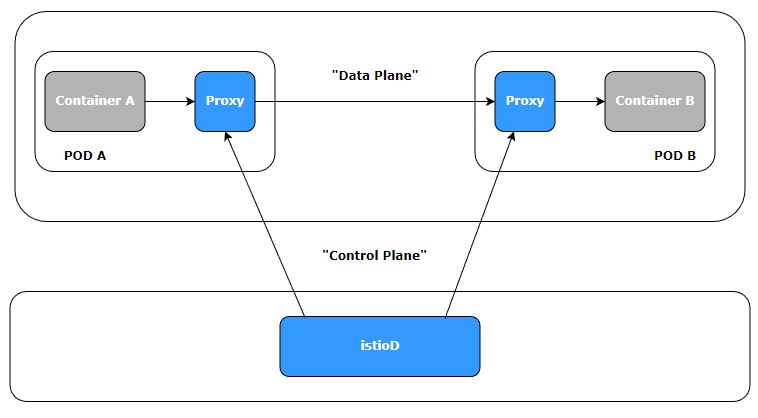
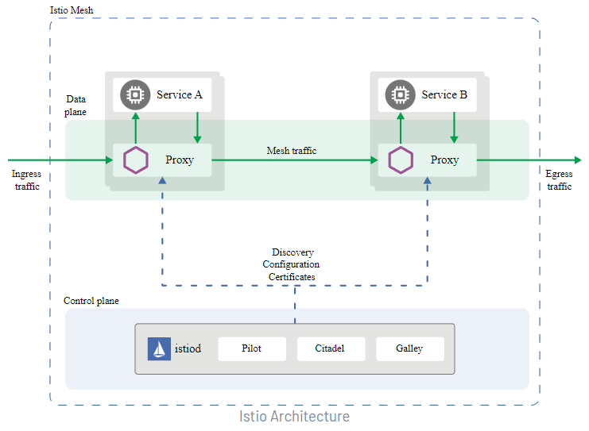

# Service Mesh Istio

## Introdução

- Aula 1: Introdução ao Service Mesh Istio

- Aula 2: O Mundo distribuído
    

- Aula 3: Service Mesh vs Istio
    - O que é Service Mesh?
    Service Mesh ou malha de serviço é uma camada extra adicionada junto ao seu cluster visando monitorar e modificar em tempo real o tráfego das aplicações, bem como elevar o nível de segurança e confiabilidade de todo o ecossistema.
    - O que é Istio?
    Istio é um projeto open-source que implementa service mesh visando diminuir a complexidade no gerenciamento de aplicações distribuídas independente de qual linguagem ou tecnologia(s) que foram desenvolvidas.
    - Istio funciona em diversas plataformas, tais como, Kubernetes, Apache Mesos, Consul e NOMAD.

- Aula 4: Principais recursos
    - Por que preciso de uma Service Mesh? Istio?
        - Gerenciamento de tráfego
            - Gateways (Entrada e saída)
            - Load Balacing
            - Timeout
            - Políticas de retry
            - Circuit Breaker
            - Fault Injection
        - Observabilidade
            - Métricas
            - Traces distribuídos
            - Logs
        - Segurança
            - Man-in-the-middle
            - mTLS
            - AAA (authentication, authorization e audit)

- Aula 5: Arquitetura do Istion
    - Dinâmica && Sidecar Prpxy
    
    - Arquitetura do Istio
    

- Aula 6: Monitoramento em tempo real
    - Mostrado a ferramenta que será utilzada para monitoramento (Kiali)

## Código Fonte

- Aula 7: Código fonte
    - Disponibilizado repositório git para acompanhamento das aulas <https://github.com/devfullcycle/fc-istio>

## Instalação

- Aula 8: Instalação
    - Falando sobre o processo de instalação do Istio e o que será utilizado no decorrer das aulas

- Aula 9: Instalando k3d
    - 